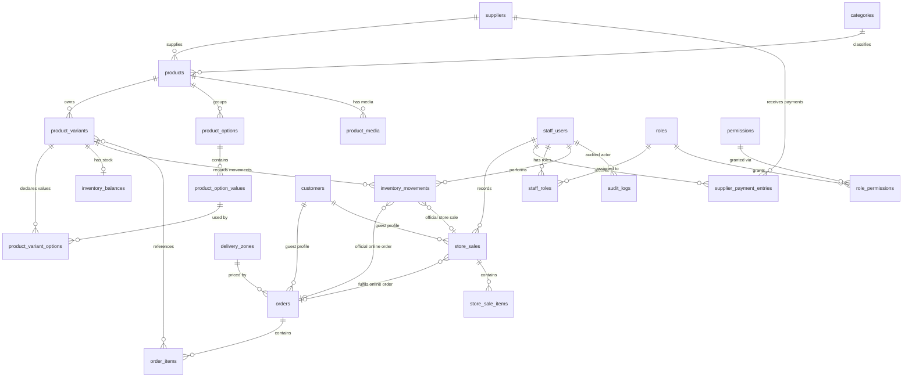

# Like Honey — Data Model (V1)

> Source of truth: `packages/db/src/schema` (Drizzle ORM on Neon PostgreSQL).
> The initial migration is `packages/db/drizzle/migrations/0000_marvelous_paibok.sql`.
> Companion documents: [`SKU_STANDARD.md`](./SKU_STANDARD.md),
> [`INVENTORY_RULES.md`](./INVENTORY_RULES.md).

## 1. Purpose and scope

This document defines the Like Honey V1 relational model that every backend
service (product management, checkout, store sales, reporting) will be built
against. It is an **engineering contract**: the schema is authoritative and this
document explains why each decision exists.

V1 scope guardrails (from `docs/requirements/APPROVED_V1_SCOPE.md`):

- **No customer accounts** — guest checkout only.
- **No authentication** — staff identity and RBAC tables exist; auth flows are a
  separately approved future phase.
- **No accounting system** — supplier payments are simple settlement records.
- **Cash on Delivery only** — no payment SDKs, no payment webhooks.
- **No seed data** — no realistic business rows exist until real data or an
  approved development fixture is required.

## 2. Shared foundations

### Bilingual data policy (Arabic-first / English)

Arabic and English are **both first-class system languages** — English is not a
fallback translation added later; it is authored and stored in the data model
from day one. This policy governs every human-readable value in the schema:

1. **Arabic + English are first-class.** Staff and customers can run the system
   entirely in Arabic, and entirely in English.
2. **Arabic is the default** operational/customer language.
3. **English is a first-class alternative**, never a requirement for operators.
4. **Technical identifiers are language-neutral** ASCII: SKU, stable category
   `code`, slugs, setting keys, enum values, UUIDs, R2 object keys and API
   identifiers are never translated.
5. **Human-readable catalog/domain values support both languages** where their
   intended audience exists (customers and staff).
6. **DB enum values stay stable machine values** (`processing`, `completed`, …);
   the database never stores translated labels. Human labels are defined in
   `packages/shared/src/domain/localization.ts` — a strict, typed label map per
   enum (Arabic + English), resolved at the UI layer.
7. **UI labels for enums/statuses are localized outside the DB.** Raw enum
   values must never be rendered to Arabic-speaking staff.
8. **Order snapshots preserve bilingual historical display data** so past
   orders render correctly in either language even after catalog edits.
9. **Settings separate the machine key from the human label.** Key + typed
   value live in the DB; labels live in the UI keyed by the setting key. A
   setting whose _value itself_ is human-readable stores a localized shape.
10. **No generic translation/EAV infrastructure** is used: a real V1
    requirement is the only justification, and none currently exists.

Human-readable columns follow one of three explicit patterns:

| Pattern                                   | Meaning                                                                                              | Examples                                                                                                                                                |
| ----------------------------------------- | ---------------------------------------------------------------------------------------------------- | ------------------------------------------------------------------------------------------------------------------------------------------------------- |
| **Type A — customer-facing display text** | explicit `*_ar` + `*_en`, both required                                                              | product/category/option/value names, content titles & bodies, delivery-zone names, media alt text, order item name + variant-label snapshots            |
| **Type B — staff-facing labels**          | `*_ar` required, `*_en` optional (Arabic default, transcript optional)                               | supplier & staff display names, role/permission names + descriptions                                                                                    |
| **Type C — operational free text**        | single language-neutral field, written in the workplace language (Arabic by default), not translated | supplier contact/address/notes, customer note, order vendor note, cancellation reason, inventory movement reason, store-sale note, payment period/notes |

Convention: **one row carries both languages** (`*_ar` / `*_en` columns) — never
per-language rows.

### Money (integer minor units)

All monetary columns are `integer` **minor units** (`145.00 ILS` → `14500`).
Never store or compute money as floats. A companion `currency varchar(3)` column
defaults to `ILS` on every monetary table. Helpers live in
`packages/shared/src/domain/money.ts`. All money columns have `>= 0` CHECK
constraints.

### Timestamps

`created_at` (and `updated_at` where the row is editable) are
`timestamp with time zone` defaulting to `now()`. `updated_at` is maintained by
service code at write time (Postgres has no `ON UPDATE` clause).

### Statuses, not deletions

Business entities are **soft-disabled** via status enums and are never hard
deleted. Foreign keys use `restrict` or `set null`/`cascade` deliberately (see
§16). `archived` product status keeps historical orders and reports intact while
hiding the product, mirroring physical-store behaviour.

### Enum types (database-level)

Statuses and typed categories are PostgreSQL `ENUM`s defined in
`packages/db/src/schema/enums.ts`:

| Enum                      | Values                                                                                                                          |
| ------------------------- | ------------------------------------------------------------------------------------------------------------------------------- |
| `product_status`          | `draft`, `active`, `inactive`, `archived`                                                                                       |
| `variant_status`          | `draft`, `active`, `inactive`                                                                                                   |
| `inventory_movement_type` | `INITIAL_STOCK`, `RESTOCK`, `ONLINE_ORDER`, `ORDER_CANCELLATION_RESTORE`, `RETURN`, `DAMAGE`, `MANUAL_ADJUSTMENT`, `STORE_SALE` |
| `order_status`            | `processing`, `delivering`, `completed`, `cancelled`                                                                            |
| `payment_method`          | `cod` (Cash on Delivery)                                                                                                        |
| `payment_status`          | `unpaid`, `paid`                                                                                                                |
| `media_type`              | `image`, `video`                                                                                                                |
| `content_status`          | `draft`, `published`, `archived`                                                                                                |
| `entity_status`           | `active`, `inactive` (categories, suppliers, staff)                                                                             |

Enum value arrays must stay **inline** in `enums.ts` because `drizzle-kit
generate` resolves enums at codegen time. The database is the source of truth for
the machine values; human labels (Arabic + English) are resolved at the UI layer
through `packages/shared/src/domain/localization.ts` — see the bilingual data
policy in §2. Raw enum values are never displayed.

## 3. Entity map

| Table                              | Purpose                                     |
| ---------------------------------- | ------------------------------------------- |
| `suppliers`                        | Companies Like Honey buys stock from        |
| `supplier_payment_entries`         | Monthly settlement payments to suppliers    |
| `categories`                       | Store categories (clothing, shoes, toys, …) |
| `products`                         | A sellable product concept                  |
| `product_media`                    | R2 object metadata per product              |
| `product_options`                  | Option dimensions (Size, Color, …)          |
| `product_option_values`            | Values of an option (`PNK`, `30`)           |
| `product_variants`                 | Sellable combination with price + SKU       |
| `product_variant_options`          | Join: variant ↔ option values               |
| `inventory_balances`               | Current stock per variant                   |
| `inventory_movements`              | Append-only stock movement ledger           |
| `customers`                        | Opt-in guest profiles keyed by phone        |
| `orders`                           | Guest online orders (COD)                   |
| `order_items`                      | Line items with immutable snapshots         |
| `store_sales`                      | In-app physical-store sales                 |
| `store_sale_items`                 | Store-sale line items with snapshots        |
| `staff_users`                      | Employees                                   |
| `roles` / `permissions`            | RBAC dictionaries                           |
| `staff_roles` / `role_permissions` | RBAC assignments (M2M)                      |
| `content_pages`                    | Editorial pages                             |
| `delivery_zones`                   | Delivery areas with COD fees                |
| `store_settings`                   | Typed key/value configuration               |
| `audit_logs`                       | Append-only change trail                    |

### Entity-relationship overview



## 4. Catalog and product hierarchy

```
Supplier (suppliers) ──< products >── Category (categories)
                              │
                              ├── media (product_media)      – one row per R2 object
                              ├── options (product_options)  – e.g. Size
                              └── variants (product_variants)– one row per sellable SKU
```

- `products` records the concept; **sales always go through variants**.
- `products.sequence` is an identity column feeding the SKU product-number.
- `categories.code` is a stable uppercase ASCII code (e.g. `SHO`) embedded in
  SKUs; it never changes after SKUs exist. Products without a category use the
  fallback `GEN` at SKU build time.
- Media rows store **R2 object keys + metadata only** (dimensions, bytes, MIME,
  sort order, primary flag). URLs are minted by the backend at request time.
  Exactly one `is_primary = true` row per product (partial unique index).

## 5. Product variant model

A variant is the smallest sellable unit:

- **Price and SKU live on the variant**, not the product, so `Pink / 30` can
  differ from `Blue / 30`.
- A product with **no options has exactly one default variant**; it is created
  automatically with the default SKU suffix `DEF`.
- `product_variant_options` links each variant to the option values it
  embodies; the label (e.g. `Pink / 30`) is stored on the variant
  (`option_label_*`) for snapshotting and search.
- A variant is purchasable only when `status = 'active'` **and** it has a SKU
  (the SKU column is mandatory and database-unique).
- Variant lifecycle: `draft → active → inactive`, or `draft → active → archived`
  at the product level. Archiving a product never deletes variants or history.

## 6. SKU standard

Every sellable variant has a unique, immutable, human-readable internal SKU:

```
LH-{CATEGORY_CODE}-{PRODUCT_SEQUENCE}-{VARIANT_SUFFIX}
SHO-000123-PNK-30          (example)
```

Full rules, examples and the immutability policy live in
[`SKU_STANDARD.md`](./SKU_STANDARD.md). An internal code only — not GS1/EAN/UPC.

## 7. Inventory

One shared pool per variant serves online orders and store sales.
`inventory_balances.quantity_on_hand` is the **authoritative** current
operational stock state; `inventory_movements` is the immutable audit ledger
explaining every change. Future services MUST update both in one PostgreSQL
transaction — they are not independent sources of truth. Rules, invariants and
the required atomic operations are in
[`INVENTORY_RULES.md`](./INVENTORY_RULES.md). **V1 has no stock reservation**:
cart does not touch stock; order submission atomically deducts and logs a
movement; cancellation atomically restores and logs a movement.

## 8. Customers (guest, consent-based)

- `customers` rows exist **only** for shoppers who consent to data retention,
  keyed by `phone_normalized` (unique). No accounts, passwords or sessions.
- Consents are explicit booleans (`consent_to_store_data`, `consent_to_contact`)
  with a `consent_given_at` timestamp. Birth date is optional and stored only
  with consent.
- Orders **do not require** a customer row: they snapshot the phone, name and
  address at checkout, so order history survives profile deletion.

## 9. Orders (online, COD)

- `orders.sequence` is an identity-backed numeric sequence; `orders.number` is a
  PostgreSQL **stored generated column** (`'LH-' || lpad(sequence, 6, '0')`) —
  non-null and unique by construction, no service layer has to remember to
  populate it. Internal UUID (`id`) and human sequence remain separate concerns.
- Customer + delivery + billing intent snapshots: normalized phone and city /
  address lines (EN + AR), delivery zone reference.
- Money snapshots at checkout: `delivery_fee_minor`, `subtotal_minor`,
  `tax_minor` (currently 0), `total_minor`.
- Minimal `status` lifecycle (`order_status`): `processing → delivering →
completed`, plus `cancelled` (from `processing`). No provisional/fulfilment
  states beyond that.
- `payment_method = 'cod'` only; `payment_status` tracks cash settlement.
- `order_items` snapshot `sku_snapshot`, product names (AR + EN), variant label
  (AR + EN), unit price, quantity and line total so catalog edits and price
  changes never rewrite history — and so historical orders render in either
  language without re-reading the catalog.

## 10. Store sales (physical register, in-app)

- Recorded by an active `staffUsers` row; instant (no status workflow).
- Quantity-first: `store_sale_items.unit_price_minor` is a **best-effort
  auto-snapshot** of the live catalog price. These prices are margin/reporting
  material only and are flagged as potentially imprecise — no POS terminal
  integration exists in V1.
- `store_sales.order_id` links a store sale that fulfils an online order (e.g.
  store pickup) so inventory attribution stays accurate.
- `store_sale_items` carry the same bilingual snapshots as order items
  (`product_name_{ar,en}_snapshot`, `variant_label_{ar,en}_snapshot`), so a
  register receipt can be produced in Arabic or English.

## 11. Staff and RBAC

- `staff_users`: employees only; `phone_normalized` unique, optional email.
  Display name is Arabic-required (`name_ar`) with an optional English
  transcription (`name_en`) — staff-facing Type B. **No password/session/
  credential columns** — authentication is a separately approved future phase.
- `roles` (e.g. `owner`, `manager`, `staff`) and `permissions`
  (e.g. `products:write`) use stable ASCII `code`s; their names and
  descriptions are bilingual with Arabic required (Type B). M2M bridges
  `staff_roles` and `role_permissions`. The authorization decision layer
  consumes these later.
- Staff are deactivated (`entity_status`), never deleted.

## 12. Content and settings

- `content_pages`: editorial pages (Shipping & Returns, About, FAQ) with
  `slug` unique, bilingual titles and bodies (Type A), publish workflow.
- `delivery_zones`: named areas with `fee_minor`; bilingual names (Type A),
  stable ASCII `code` (Type D); control COD-fee display.
- `store_settings`: typed key/value JSON (`checkout:cod.enabled` →
  `{"enabled":true}`); shapes validated by Zod at the service layer. The
  **key is technical** (Type D) and is never translated. Human-readable
  **labels for settings keys live in the UI layer**, keyed by the setting key,
  not in the database. A setting whose **value itself is human-readable** (e.g.
  an announcement message) stores a localized shape inside its JSON value
  (`{"ar": "...", "en": "..."}`); numeric, boolean and other technical values
  need no translation. Settings never become an English-only operational
  surface.

## 13. Suppliers

- `suppliers` is the entity Like Honey **purchases stock from** — not the
  manufacturer and not necessarily the consumer-facing brand. Display name is
  Arabic-required with an optional English transcription (Type B); contact,
  address and notes are operational free text (Type C).
- `supplier_payment_entries`: one row per monthly settlement
  (`period_label`, `amount_paid_minor`, `paid_at`, recording staff member).

## 14. Audit trail

`audit_logs` (append-only): actor type (`staff`/`system`), actor staff id,
action (`order.status_changed`), target entity type + id, and compact JSON
metadata. Sensitive values are never stored in `metadata_json` — references and
short codes only. Services write the trail; no DB triggers.

## 15. Indexes and constraints policy

- Composite indexes follow actual access paths (listings by
  `status + created_at`, movements by `variant_id + created_at`, option values
  by `option_id + code`, …).
- Unique constraints on all business keys: category `code`, SKU, order/store-sale
  numbers (non-null, DB-generated — see §17), phones, slugs, role/permission
  codes, option-name+code pairs.
- CHECK constraints enforce money ≥ 0, quantities > 0, movement change ≠ 0, SKU
  shape and code regexes.
- `products.sequence`, `orders.sequence`, `store_sales.sequence` are identity
  columns; no manual sequence management in services.

## 16. Referential actions

| Context                                               | Action     | Rationale                                                  |
| ----------------------------------------------------- | ---------- | ---------------------------------------------------------- |
| product options/media/variants → product              | `cascade`  | Owning product defines their lifetime.                     |
| order/store-sale items, inventory → product/variant   | `restrict` | History must never be wiped; deactivate instead of delete. |
| products → supplier, movements → staff, sales → staff | `restrict` | Supplier/staff deletion blocked; deactivate instead.       |
| orders → customer/profile, delivery zone              | `set null` | Fulfilment snapshots remain; consent withdrawal safe.      |
| movements → order / store sale                        | `set null` | Ledger rows survive even if a transaction disappears.      |

## 17. Identifier generation

Human order/store-sale numbers are **computed by the database**, so ordering
services never touch the `number` column:

- `orders.number` and `store_sales.number` are stored generated columns derived
  from their identity-backed `sequence`
  (`'LH-' || lpad(sequence, 6, '0')` → `LH-000001`;
  `'LH-POS-' || lpad(sequence, 6, '0')` → `LH-POS-000001`). They are non-null and
  unique by construction.
- `packages/shared/src/domain/identifiers.ts` is the display/render helper for
  formatting a sequence value the same way.

Product SKUs are built with `buildSku` in `packages/shared/src/domain/sku.ts`
using the product sequence read back at product creation, then written onto the
default variant (and any later variant) before the variant is activated.

## 18. Reporting readiness

Dashboards and exports are derivable from the model:

- **Sales**: `order_items` / `store_sale_items` joinable to time, category,
  product, variant, channel (online vs store), and zone.
- **Money**: totals live as snapshots on orders/sales; trend cut by `created_at`.
- **Inventory value/velocity**: `inventory_movements` ledger (audit) reconciled
  against the authoritative `inventory_balances`.
- **Customers**: consented profiles with order history via normalized phone.

## 19. Non-accounting boundary (explicit)

`supplier_payment_entries` records **payments made to suppliers** but the schema
is not an accounting system: there are no ledgers, journals, charts of accounts,
double-entry postings, payroll or tax tables. This is a V1 scope decision; any
accounting/ERP features require a separate approval (see APPROVED_V1_SCOPE.md).

## 20. Migration and environment policy

- The initial migration `0000_marvelous_paibok.sql` was generated offline with
  `pnpm --filter @likehoney/db db:generate` and validated with `db:check`.
- It has **not** been applied anywhere — no `DATABASE_URL` is configured in the
  development environment. Migrations must never run against a non-development
  database.
- `db:migrate` / `db:studio` assume a configured development database and must
  not run casually.
